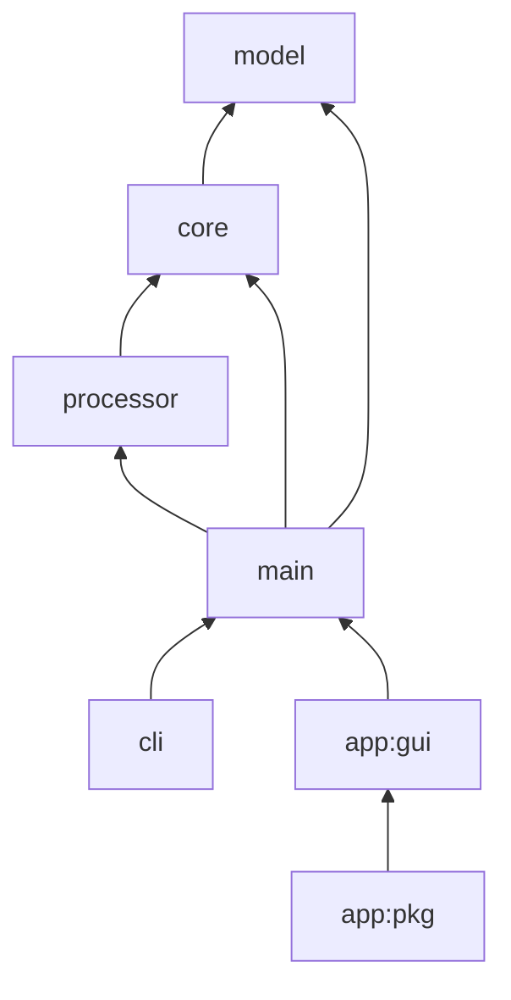

# Architecture description
`gtfs-validator` is composed of a number of modules, as shown in the following dependency diagram:



## Main
_Depends on: `processor`, `core`, and `model`_

If you're looking to add new GTFS fields or rules, you'll want to look at this module and read the section on [adding new tables and fields](#adding-new-tables-and-fields).

Contains:
- GTFS [table schemas](/main/src/main/java/org/mobilitydata/gtfsvalidator/table) - Defines how GTFS files (e.g., `trips.txt`) and the fields contained within that file (e.g., `trip_id`) are represented in the validator. You can add new GTFS files and fields here.
- Business logic [validation rules](/main/src/main/java/org/mobilitydata/gtfsvalidator/validator) - Code that validates GTFS field values. You can add new validation rules here.
- Error [notices](/main/src/main/java/org/mobilitydata/gtfsvalidator/validator) - Containers for information about errors discovered during validation. You can add a new notice as a nested `static` class annotated with `@GtfsValidationNotice` in the corresponding validation rule class.
- Report [generators](/main/src/main/java/org/mobilitydata/gtfsvalidator/report) - Create reports and summaries of the notices generated by the rule validators.

### Generated Classes
The architecture leverages `AutoValue` and annotations in `Gtfs[File]Schema.java` classes (such as [`GtfsTripSchema.java`](../main/src/main/java/org/mobilitydata/gtfsvalidator/table/GtfsTripSchema.java)) in `main` to auto-generate the following classes used for loading and validating each _File_. A class is only generated if the `Schema` class is [annotated](#annotations-definitions) to generate that type of class.
* `Gtfs[File].java`
  * Internally represents an entity in a GTFS _File_
  * Example: `GtfsStopTime.java`
* `Gtfs[Field].java`
  * Enumerates the possible values for an enumerated _Field_
  * Example: `GtfsFrequencyExactTimes.java`
* `Gtfs[Field]Enum.java`
  * An interface for each _Field_ with enumerated values, implemented by each `Gtfs[Field].java`
  * Example: `GtfsFrequencyExactTimesEnum.java`
* `Gtfs[File]TableContainer.java`
  * Represents an instance of a GTFS _File_ as a table, including its entities
  * Example: `GtfsRouteTableContainer.java`
* `Gtfs[File]TableDescriptor.java`
  * Describes the specification of the table representation of a GTFS _File_
  * Example: `GtfsStopTableDescriptor.java`
* `Gtfs[File][Annotation]Validator.java`
  * Validates all fields with a particular validating _Annotation_ in a Gtfs _File_
  * Example: `GtfsAgencyMixedCaseValidator.java`
* `Gtfs[File][Field][Annotation]Validator.java`
  * Validates a particular _Field_ with a particular validating _Annotation_ in a Gtfs _File_
  * Example: `GtfsAttributionAgencyIdForeignKeyValidator.java`
* `AutoValue_Gtfs[File]TableContainer_CompositeKey.java`
  * Builder for composite keys for entities in a _File_ where multiple fields comprise the primary key
  * Example: `AutoValue_GtfsTransferTableContainer_CompositeKey.java`

To generate these classes with AutoValue, [build the project](BUILD.md). When annotations are modified, the project must be rebuilt for the changes to propagate.

## Processor
_Depends on: `core`_

Contains:
- A file analyser to analyse annotations on Java interfaces that define GTFS schema and translate them to descriptors
- Descriptors of annotations fields (`ForeignKey`, `GtfsEnum`, `GtfsField`, `GtfsFile`)
- A processor to auto-generate data classes, loaders and validators based on annotations on GTFS schema interfaces
- GTFS entity classes to generate class names for a given GTFS table
- Code generators to generate code from annotations found by file analyser (_e.g._ `EnumGenerator`)

## Core
_Depends on: `model`_

Contains:
- Code to read zipped and unzipped file input
- CSV file and row parsers
- Notice to be generated when checking data type validation rules such as `EmptyFileNotice`
- A notice container (`NoticeContainer`)
- GTFS data type definitions such as `GtfsTime`, `GtfsDate`, or `GtfsColor`
- `GtfsFeedLoader` to load for a whole GTFS feed with all its CSV files
- GTFS feed's name

## Model
_Depends on: nothing_

Contains:
- root interfaces and annotations for modeling a GTFS schema table

Business logic should generally *not* be added to this module.


## CLI
_Depends on: `main`_

A [command-line-based application](/cli/src/main/java/org/mobilitydata/gtfsvalidator/cli) for running the validator.

## App:Gui
_Depends on: `main`_

A [GUI-based application](/app/gui/src/main/java/org/mobilitydata/gtfsvalidator/app/gui) for running the validator as a desktop application.

## App:Pkg
_Depends on: `app:gui`_

A [minimal wrapper]((/app/pkg/src/main/java/org/mobilitydata/gtfsvalidator/app/pkg)) around `app:gui` designed to facilitate packaging the GUI application as a Java Module and producing standalone executables and installers for various platforms.

## Data pipeline 📥➡️♨➡️📤

1️⃣ **Inputs**
- A local GTFS archive (zip file) or fully qualified URL from which to download a GTFS archive
- Command line arguments

2️⃣ **Validator loading**
- Locate all validators annotated with `@GtfsValidator` and load them

3️⃣ **Feed loading**
- Read GTFS files
- Create `GtfsTableContainer` from data
- Invoke and execute all `SingleEntityValidators` to validate data types, etc.

4️⃣ **Validators execution**
- Invoke and execute all `FileValidators` in parallel to validate GTFS semantic rules

5️⃣ **Notice export**
1. Creates path to export notices as specified by command line input `--output` (or `-o`).
1. Export notices from `NoticeContainer` to two JSON files in the specified directory - `report.json` for validator results and `system_errors.json` for any software errors that occurred during validation. Notices are alphabetically sorted in the `.json` files.

## Adding new tables and fields

Let's say that you are an agency which for some reason uses `other_file.txt` as an additional table to represent GTFS information, and your goal is to implement validation rule related to this new table.
To do so, you would have to:
1. add the new table to the validator as an annotated `Gtfs[OtherFile]Schema.java` class in [main](../main/src/main/java/org/mobilitydata/gtfsvalidator/table);
1. implement the new semantic validation rules and notices in [main](../main/src/main/java/org/mobilitydata/gtfsvalidator/validator).

This section details how existing table are defined and gives information on annotation usage. One can then transpose these explanations to add a new table or field. Let's take a look at [`GtfsCalendarSchema`](../main/src/main/java/org/mobilitydata/gtfsvalidator/table/GtfsCalendarSchema.java):

```java
package org.mobilitydata.gtfsvalidator.table;

import org.mobilitydata.gtfsvalidator.annotation.ConditionallyRequired;
import org.mobilitydata.gtfsvalidator.annotation.EndRange;
import org.mobilitydata.gtfsvalidator.annotation.FieldType;
import org.mobilitydata.gtfsvalidator.annotation.FieldTypeEnum;
import org.mobilitydata.gtfsvalidator.annotation.GtfsTable;
import org.mobilitydata.gtfsvalidator.annotation.PrimaryKey;
import org.mobilitydata.gtfsvalidator.annotation.Required;
import org.mobilitydata.gtfsvalidator.type.GtfsDate;

@GtfsTable("calendar.txt")
@ConditionallyRequired
public interface GtfsCalendarSchema extends GtfsEntity {
  @FieldType(FieldTypeEnum.ID)
  @PrimaryKey
  @Required
  String serviceId();

  @Required
  GtfsCalendarService monday();

  @Required
  GtfsCalendarService tuesday();

  @Required
  GtfsCalendarService wednesday();

  @Required
  GtfsCalendarService thursday();

  @Required
  GtfsCalendarService friday();

  @Required
  GtfsCalendarService saturday();

  @Required
  GtfsCalendarService sunday();

  @Required
  @EndRange(field = "end_date", allowEqual = true)
  GtfsDate startDate();

  @Required
  GtfsDate endDate();
}
```

By order of appearance in the interface definition:
* `@GtfsTable`: annotates the interface that defines schema for `calendar.txt` - The [`processor`](../processor) will generates data classes, loaders and validators based on annotations on this GTFS schema interface.
* `@ConditionallyRequired`: hints that this file is conditionally required.
* `@FieldType`: specifies `calendar_service_id` is defined as an ID by the GTFS specification.
* `@PrimaryKey`: specifies `calendar_service_id` is the primary key of this table.
* `@Required`: specifies a value for `calendar_service_id` is required - A notice will be issued at the parsing stage.
* `@EndRange`: specifies `endDate` is the end point for the date range defined by `calendar.start_date` and `calendar.end_time` - A validator will be generated and check if `calendar.start_date` is before or equal to `calendar.end_date`.

## Annotations definitions

| Annotation                                                                                                          	                       | Definition                                                                                                                                                              	                                                                     |
|---------------------------------------------------------------------------------------------------------------------------------------------|-----------------------------------------------------------------------------------------------------------------------------------------------------------------------------------------------------------------------------------------------|
| [`@CachedField`](../model/src/main/java/org/mobilitydata/gtfsvalidator/annotation/CachedField.java)                     	                   | Enables caching of values for a given field to optimize memory usage.                                                                                                   	                                                                     |
| [`@ConditionallyRequired`](../model/src/main/java/org/mobilitydata/gtfsvalidator/annotation/ConditionallyRequired.java) 	                   | A hint that a field or a file is conditionally required and custom validators should validate the requirement.                                                                                                                              	 |
| [`@CurrencyAmount`](../model/src/main/java/org/mobilitydata/gtfsvalidator/annotation/CurrencyAmount.java)                     	             | Specifies a field represents a currency and should be interpreted according to `currencyField`.                                                                                                   	                                           |
| [`@DefaultValue`](../model/src/main/java/org/mobilitydata/gtfsvalidator/annotation/DefaultValue.java)                   	                   | Specifies a default value for a particular GTFS field.                                                                                                                  	                                                                     |
| [`@EndRange`](../model/src/main/java/org/mobilitydata/gtfsvalidator/annotation/EndRange.java)                           	                   | Specifies a field for the end point of a date or time range.                                                                                                            	                                                                     |
| [`@FieldType`](../model/src/main/java/org/mobilitydata/gtfsvalidator/annotation/FieldType.java)                         	                   | Specifies type of a GTFS field, e.g., [`COLOR`](http://gtfs.org/reference/static#field-types) or [`LATITUDE`](http://gtfs.org/reference/static#field-types).            	                                                                     |
| [`@ForeignKey`](../model/src/main/java/org/mobilitydata/gtfsvalidator/annotation/ForeignKey.java)                       	                   | Specifies a reference to a foreign key.                                                                                                                                 	                                                                     |
| [`@Generated`](../model/src/main/java/org/mobilitydata/gtfsvalidator/annotation/Generated.java)                         	                   | Marker for all classes generated by annotation processor.                                                                                                               	                                                                     |
| [`@GtfsEnumValue`](../model/src/main/java/org/mobilitydata/gtfsvalidator/annotation/GtfsEnumValue.java)                 	                   | Specifies a value for a GTFS enum.                                                                                                                                      	                                                                     |
| [`@GtfsEnumValues`](../model/src/main/java/org/mobilitydata/gtfsvalidator/annotation/GtfsEnumValues.java)               	                   | It is necessary for making GtfsEnumValue annotation repeatable.                                                                                                         	                                                                     |
| [`@GtfsTable`](../model/src/main/java/org/mobilitydata/gtfsvalidator/annotation/GtfsTable.java)                         	                   | Annotates an interface that defines schema for a single GTFS table, such as `stops.txt`.                                                                                	                                                                     |
| [`@GtfsValidationNotice`](../model/src/main/java/org/mobilitydata/gtfsvalidator/annotation/GtfsValidationNotice.java)                     	 | Identifies, configures, and documents a validation notice.                                                                                                   	                                                                                |
| [`@GtfsValidator`](../model/src/main/java/org/mobilitydata/gtfsvalidator/annotation/GtfsValidator.java)                 	                   | Annotates both custom and automatically generated validators to make them discoverable on the fly.                                                                      	                                                                     |
| [`@Index`](../model/src/main/java/org/mobilitydata/gtfsvalidator/annotation/Index.java)                                 	                   | Asks annotation processor to create an index for quick search on a given field. The field does not need to have unique values.                                          	                                                                     |
| [`@MixedCase`](../model/src/main/java/org/mobilitydata/gtfsvalidator/annotation/MixedCase.java)                     	                       | Specifies a string field should have a mixed-case value.                                                                                                   	                                                                                  |
| [`@NonNegative`](../model/src/main/java/org/mobilitydata/gtfsvalidator/annotation/NonNegative.java)                     	                   | Generates a validation that an integer or a double (float) field is not negative.                                                                                       	                                                                     |
| [`@NonZero`](../model/src/main/java/org/mobilitydata/gtfsvalidator/annotation/NonZero.java)                             	                   | Generates a validation that an integer or a double (float) field is not zero.                                                                                           	                                                                     |
| [`@Positive`](../model/src/main/java/org/mobilitydata/gtfsvalidator/annotation/Positive.java)                           	                   | Generates a validation that an integer or a double (float) field is positive.                                                                                           	                                                                     |
| [`@PrimaryKey`](../model/src/main/java/org/mobilitydata/gtfsvalidator/annotation/PrimaryKey.java)                       	                   | Specifies a field is the or part of the primary key in a GTFS table. Adds validation that each entry's set of primary key fields is unique in the table.                                                                      	               |
| [`@Recommended`](../model/src/main/java/org/mobilitydata/gtfsvalidator/annotation/Recommended.java)                     	                   | For a file, specifies the file is recommended. For a field, specifies the column and all non-empty values are recommended.                                                                                                  	                 |
| [`@RecommendedColumn`](../model/src/main/java/org/mobilitydata/gtfsvalidator/annotation/RecommendedColumn.java)                     	       | For a field, specifies the column is recommended, but empty values in that field do not violate the recommendation.                                                                                                   	                       |
| [`@Required`](../model/src/main/java/org/mobilitydata/gtfsvalidator/annotation/Required.java)                           	                   | For a file, specifies the file is recommended. For a field, specifies the column and all non-empty values are required.                                                                                                                 	     |
| [`@RequiredColumn`](../model/src/main/java/org/mobilitydata/gtfsvalidator/annotation/RequiredColumn.java)                     	             | For a field, specifies the column is required, but empty values in that field do not violate the requirement.                                                                                                   	                             |

