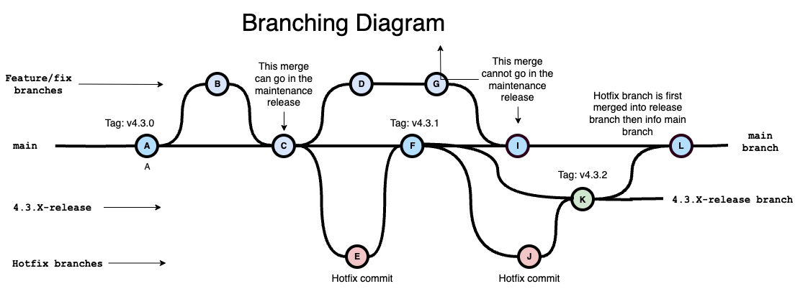

# Branching Strategy for releases

## General Considerations

- Generally the master branch is the one where current development is happening.
- For the sake of simplicity, one objective would be to minimize the number of long-lived branches, for example branches dedicated to maintenance releases.
 

## Release numbering
- example 4.3.0
- The first number (4 in this example) is incremented for major changes in the software. 
  - A major change impacts the rules, either errors or warnings OR includes breaking changes for users.
- The second number (3 in this example) is incremented for minor changes in the software.
  - A minor change is non-breaking for users, and doesn't impact validation rules.
- The third number (0 in this example) is used for maintenance releases.
  - A maintenance is created if some bug has to be corrected before the next scheduled release.
    - As an example see [#1663](https://github.com/MobilityData/gtfs-validator/pull/1653) in the gtfs-validator repository.
  

## Feature/fix branches

- Feature/fix branch are created for every feature we want to add to the software (or bug we want to fix).
- They stem from master, are usually short-lived and are merged back to master.

## Maintenance/release branches
- In general we will try not to create long-lived release branches.
- A long-lived release branch will be created only if any merge to master that came after the previous release is deemed not suitable to go in the maintenance release.
- For example the change could be too extensive, or introduce an undue risk in the maintenance release. 
  - This is true in particular if the testing infrastructure is not sufficient, meaning it's more difficult to know if a change is safe.

## Hotfixes
- We should strive to not do hotfixes, but sometimes it's inevitable.
- A hotfix will generally result in a maintenance release.
- Hotfixes branches are similar to feature branches, but we should consider using the prefix `hotfix:` for such issues and PRs.
- Where does the hotfix branch stem from:
    - Generally from the commit that was tagged for the latest release.
        - See for example commit A in the diagram.
    - In keeping with the **Minimize Branching** objective, we will allow the hotfix branch to stem from a commit
      downstream of the previous release commit if:
        - we consider that all merges coming from feature branches that happened after the previous release can go in the maintenance release.
            - For example if commit C from the diagram contains minor changes like typos we could decide that it's OK to include it in the maintenance release.
            - In that case the hotfix branch can stem from commit C and be merged back into master in commit F.
            - Commit F is tagged as the maintenance release and the maintenance release is built from there.
    - If a merge on the master branch cannot be included in the maintenance release (See for example commit I) then we have no choice but to create a maintenance branch
        - Create a maintenance branch stemming from the last commit of master that can go in the maintenance release. Commit F in our example.
          - This branch becomes a long-lived branch that can be used for further maintenance releases and should be protected from deletion.
          - This branch should require pull request to add commits to it.
        - After that, master cannot be merged into the maintenance branch, since it would introduce undesirable commits.
        - Also create a hotfix branch stemming from the same commit (commit F in our example)
        - Once fixed, merge the hotfix branch into the maintenance branch. This creates commit K, that should be tagged and used for the maintenance release.
        - Also merge the maintenance branch into master.
            - Do not delete the maintenance branch. It can be used for further maintenance releases.
            - Merging into master creates commit L in the diagram. Note that at this point there could be conflicts so it becomes important to merge carefully.
 