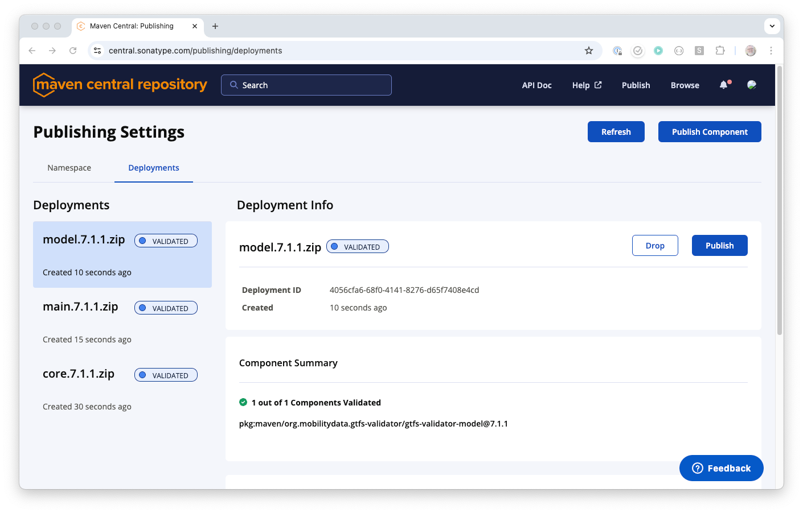

# Release instructions
### 1. Update documentation
Update the [README.md](/README.md) to match the latest developments. The documentation should accurately reflect the use of the `jar` that is to be released. 

### 2. Update NOTICE_MIGRATION.md file
- [NOTICE_MIGRATION.md](https://github.com/MobilityData/gtfs-validator/blob/master/docs/NOTICE_MIGRATION.md) is a file that is committed in git. To change it, you need a pull request.
- Modifying the file and creating the PR can be done automatically by executing the `Update NOTICE_MIGRATION.md` GitHub action (found [here](https://github.com/MobilityData/gtfs-validator/actions/workflows/notice_migration_generation.yml)).
- When running the Github action, you need to specify the new version that will soon be released (e.g. v5.0.2).
- The action will modify the file and create a pull request with this title: `docs: Automated update of NOTICE_MIGRATION.md`
- Examine the pull request and if satisfactory merge it.

### 3. Do a pre relase
1. Go to the release section of GitHub 

1. Start a draft release 
1. Create a tag like `v1.3.2` and **use the current master branch**
1. Leave the release description empty
1. Check the `this is a pre release checkbox`
1. Publish the prerelease


### 4. Run analytics comparing the pre-release with the last release. 
1. Generate analytics based on the acceptance tests to identify any performance concerns or problems with new notices. [Example report here](https://docs.google.com/spreadsheets/d/1AH4fELPPIB3R3w_TPGUBzSn_T6cVuYpmekW-er1Xogg/edit#gid=0). 
2. Identify if any critical issues should be resolved before release. 

### 5. Do the release
1. While CI is running to create the artifacts, you can work on the release description. 


💡 Command to find PRs merged after a certain date:
```
is:pr is:closed merged:>2020-07-28 base:master sort:updated-desc 
```
2. When the CI is done, drag and drop the artifacts in the pre release assets section. You'll need to manually rename some of the assets for now (see below).

3. Rename the artefacts so the names to stay consistent with previous releases. **It is important that the installers artefacts always have exactly the same name**, in order to have stable URL's that point to the latest installer. The installers should be named as follow:
- Installer.windows.zip
- Installer.ubuntu.zip
- Installer.macos.zip

4. Once everything is ready, simply uncheck the `pre release` box and publish again ✅


💡 For more details on versioning, see [Understanding Maven Version Numbers](https://docs.oracle.com/middleware/1212/core/MAVEN/maven_version.htm#MAVEN8855).

### 6. Remove all `sha` Docker images added since last release
1. Find the [list of Docker images for this project.](https://github.com/orgs/MobilityData/packages/container/gtfs-validator/versions)
1. Delete all `sha`tagged Docker images added since last release.

**⚠️ Note: this manipulation can only be done by someone whose GitHub account has `Admin` access rights over the `gtfs-validator` package.** 

### 7. Update the release number in the wiki and on gtfs.org
The version number in the project's wiki is used to inform users of the Desktop app that a new version is available, and will prompt them to upgrade if their local version does not match.
Update [this page](https://github.com/MobilityData/gtfs-validator/wiki/Current-Version) with the new version.

The version number on [gtfs.org/schedule/validate/](https://gtfs.org/schedule/validate/) is used to inform validator users of which version is currently running on [gtfs-validator.mobilitydata.org/](https://gtfs-validator.mobilitydata.org/). Update by opening a Pull Request on [github.com/MobilityData/gtfs.org](https://github.com/MobilityData/gtfs.org).

### 8. Publishing to Maven Central
* Maven central is a repository used by developers to download libraries that can be used in their own development.
* We upload some jars (currently gtfs-validator-main, gtfs-validator-core and gtfs-validator-model) there to make them available.
Uploaded artefacts have versions.
* Publication to Maven Central requires some manual operations.

* Typically when doing a release the publish_assets.yml Github action is automatically run. 
This will upload some assets
to be available on the release page itself (see for example [Release 7.1.0 assets](https://github.com/MobilityData/gtfs-validator/releases/tag/v7.1.0))


* This Github action also publishes to Maven Central. 
* See [Maven Sentral Repository Deployments](https://central.sonatype.com/publishing/deployments) (login required)
* If the Github action was successful, there should be components in this page:



* You can browse the different components, look at the components files, make sure the version is correct, etc.
* Everything should be signed, as evidenced by the presence of files with extension .sha1, .sha256, .sha512 etc.
* If for some reason you think the components should not be published, you can press the `Drop` button for each component.
* If you are satisfied, you can press the `Publish` button for each of the components. 
* The result should be that the components are made available in Maven Central. See [Maven Central Repository](https://repo1.maven.org/maven2/org/mobilitydata/gtfs-validator/) for the published components.
* They will disappear from the page as you publish or drop them.

* Note that once a release is published on Maven Central, it cannot be removed or modified. If problems are detected after this stage, a new release with a different version has to be created.
